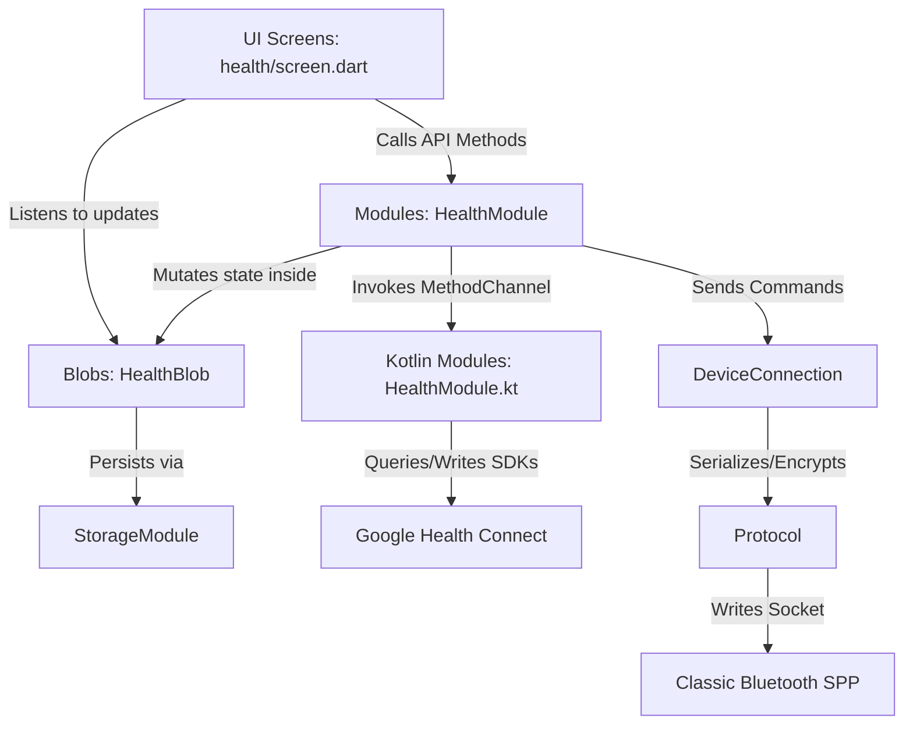

# MiSync Developer Guide

Welcome to the **MiSync** developer guide. This document serves as the onboarding and reference manual for engineers (and AI coding agents) building on top of the MiSync codebase. It covers the architecture, the Kotlin-to-Flutter native module bridging pattern, Google Health Connect integration, the Bluetooth/SPP protocol stack, cryptographic handshakes, and a guide for adding new modules.

---

## 1. Project Philosophy & Architecture

MiSync is built as a highly decoupled companion application using Flutter for cross-platform UI and Kotlin for native Android integration. The architecture separates protocol serialization, business logic, storage, and UI into clear layers, extending from the Dart UI code down into native Android SDK features like Bluetooth RFCOMM sockets, Calendar providers, and Google Health Connect:



### Core Architecture Components

1.  **`lib/main.dart` (Bootstrapper)**: Defines the global list of `modules`. Bootstraps and awaits the sequential asynchronous lifecycles of all modules in a loop.
2.  **Modules (`lib/<feature>/module.dart`)**: The logical engine of a feature.
    * Implement the **`Module`** interface (for background/framework services like `StorageModule`, `PlatformModule`).
    * Implement the **`TabModule`** interface (for user-facing features that render in navigation tabs). They override properties: `String get name` (lowercase, e.g., `'device'`, `'clock'`), `IconData get icon`, and `late final Screen screen`.
    * **Instance Access**: Modules expose themselves as a static singleton getter named `module` (e.g., `static final HealthModule _module = HealthModule._(); static HealthModule get module => _module;`).
    * **Screen Caching**: Concrete modules instantiate and cache their screens lazily as a `late final` field inside the module, passing `this` to the screen constructor:
      ```dart
      @override
      late final Screen screen = WeatherScreen(this);
      ```
    * **Best Practice**: All data mutation operations (e.g. `saveHealth`, `editAlarm`, `removeApp`) should be defined as methods on the `Module` class. Screen classes should call these methods rather than mutating blobs directly in the view layer.
3.  **Blobs (`lib/<feature>/blobs/<name>.dart`)**: Reactive state holders extending `Blob<T>`. They automatically read/write JSON values to the persistent key-value store (`StorageModule`) and notify UI screens upon updates.
4.  **Screens (`lib/<feature>/screen.dart`)**: Independent presentation layer extending `ScreenState<T>`. 
    * Screens **never** interact directly with the Bluetooth connection, execute platform method channels, or write directly to the database. They delegate updates to the `module` reference.
    * All screen widgets extend `Screen<M extends Module>` (which takes the module in its constructor). All screen state classes extend `ScreenState<T extends Screen>` and override `Widget buildScreen(BuildContext context, bool connected)`. The base class automatically wraps the tree in a `ValueListenableBuilder` listening to `DeviceModule.module.connection.connected`.
    * **Type-Safe Module Access**: Inside the state class, the module is directly accessible as `widget.module`. Since `Screen` is generically parameterized (e.g. `Screen<HealthModule>`), `widget.module` is automatically typed as the concrete module (e.g. `HealthModule`), removing any need for manual type casting or `module` getter overrides.
    * Interactive controls (switches, text fields, adding/editing/deleting elements) **must be disabled** when `connected` is false.
    * **Piggyback on refresh()**: Do **not** override `initState()` manually in a screen state to trigger initial logic or query native endpoints. Instead, override `refresh()` (and remember to await `super.refresh()`), which the base class `ScreenState` automatically invokes at initialization and connection changes.
    * **Reactive Lists**: Use `ListenableBuilder` tied directly to the module's `Blob` instance to automatically redraw views on modification and support instant, side-effect-free updates.
    * **Manifest Permissions Requirement**: If you add any custom permission (such as `calendar`) inside `module.permissions`, you must explicitly register it inside `android/app/src/main/AndroidManifest.xml` (e.g., `<uses-permission android:name="android.permission.READ_CALENDAR" />`), otherwise the permission dialog popup will fail silently.
5.  **`DeviceConnection` (`lib/device/connection.dart`)**: The Bluetooth SPP connection and protocol manager. Exposes `DeviceModule.module.connection.listen((cmd) => ...)` and `DeviceModule.module.connection.send(...)` to other modules.

---

## 2. Flutter to Kotlin Native Bridging Pattern

Certain features (like Reading from the Calendar, playing Ring Phone audio, or querying Health Connect) must execute native Android APIs. MiSync implements a decoupled, self-contained architecture for these native channels.

### Dart Side
Each feature module extends `Module` and uses `PlatformModule.module.invokeMethod` to request native actions:
```dart
final Map? latest = await PlatformModule.module.invokeMethod<Map>('health.getLatestHeightAndWeight');
```
Platform channel routing prefixes method calls with the module name (e.g. `'health.getLatestHeightAndWeight'`, `'calendar.syncEvents'`) to resolve target handlers.

### Kotlin Side
On the Android native layer, the project implements self-contained module handlers:
1. **`BaseModule` (`android/.../base/BaseModule.kt`)**: An abstract class representing a native feature handler with predefined methods for checking permissions, requesting permissions, and handling platform calls:
   ```kotlin
   abstract class BaseModule(val name: String) {
       abstract fun checkPermissions(): Boolean
       abstract fun requestPermissions(activity: Activity)
       abstract fun onMethodCall(activity: Activity, method: String, call: MethodCall, result: MethodChannel.Result): Boolean
   }
   ```
2. **Concrete Feature Modules**: Files like `HealthModule.kt`, `CalendarModule.kt`, and `DeviceModule.kt` subclass `BaseModule`. They construct their helper managers internally using the passed `Context` and define concrete actions:
   ```kotlin
   class HealthModule(private val context: Context) : BaseModule("health") {
       private val healthManager = HealthManager(context)
       // Checks and requests permissions, handles "getLatestHeightAndWeight", "writeSteps", etc.
   }
   ```
3. **Module Registration in MainActivity**: Avoid adding ad-hoc platform channel handlers inside `MainActivity.kt`. Instead, instantiate and add your custom Kotlin modules to the registration loop inside `configureFlutterEngine()`:
   ```kotlin
   // MainActivity.kt
   private val modules = listOf(
       HealthModule(this),
       CalendarModule(this),
       DeviceModule(this)
   )
   ```
   The engine automatically binds MethodChannel requests and executes matching callbacks.

---

## 3. Google Health Connect Integration

MiSync writes fitness metrics (Steps, Heart Rate, Oxygen Saturation, Distance, Sleep Stages, and Workouts) and reads demographic constraints (Height, Weight) from Google Health Connect.

### Reading Data (Demographics)
Health Connect does not expose static profile databases for fields like birthdates or gender. However, physical metrics can be queried from weight and height timelines. To import these metrics without forcing users to type them, `HealthManager.kt` queries the client for the latest logs:
```kotlin
val weightResponse = currentClient.readRecords(
    ReadRecordsRequest(
        recordType = WeightRecord::class,
        timeRangeFilter = TimeRangeFilter.after(Instant.EPOCH)
    )
)
val weight = weightResponse.records.maxByOrNull { it.time }?.weight?.inKilograms
```

### Writing Data (Activity & Workouts)
1. **Activity Streams**: Periodic tasks write cumulative records (like step counts, sleep cycles, and heart rates) into Health Connect database intervals.
2. **Workouts (Exercise Sessions)**: Health Connect uses a modular structure for workouts. An `ExerciseSessionRecord` holds only metadata (duration, sport type, title). To write calories and distance, separate records (`ActiveCaloriesBurnedRecord`, `DistanceRecord`, and `StepsRecord`) must be created covering the exact same duration and inserted in a batch list.

### Manifest Declarations
Every Health Connect record type read or written by the app must be declared in [AndroidManifest.xml](file:///Users/awgneo/Repositories/awgneo/misync/android/app/src/main/AndroidManifest.xml):
```xml
<uses-permission android:name="android.permission.health.READ_HEIGHT"/>
<uses-permission android:name="android.permission.health.READ_WEIGHT"/>
<uses-permission android:name="android.permission.health.WRITE_EXERCISE"/>
<uses-permission android:name="android.permission.health.WRITE_ACTIVE_CALORIES_BURNED"/>
```

---

## 4. Save and Sync Architectural Pattern

To keep code decoupled, clean, and bug-free, always follow the **Save and Sync** pattern when a settings value changes:

1. **Screens Read State Only**: Screens listen to Blob streams to render UI and show values. Screens **never** write directly to the database or call `Blob.update()`.
2. **Delegation to Module**: When the user edits a value (e.g. changing steps goals or selecting a birthday), the screen calls a method on the module (e.g., `module.saveHealth(updatedSettings)`).
3. **Encapsulated Sync**: The module's save method writes the updated model to the persistent `HealthBlob`, logs details using structured maps (`logger.info('User profile synced', {...})`), and immediately packages and transmits the `UserInfo` protobuf command to the watch if connected.

---

## 5. Protobuf & Code Generation

All payloads exchanged with the watch are serialized using Google Protocol Buffers. 

-   **Protobuf Source**: [proto/xiaomi.proto](file:///Users/awgneo/Repositories/awgneo/misync/proto/xiaomi.proto)
-   **Generated Files**: Located in `lib/device/proto/xiaomi.pb.dart` (and companion files).

### Compiling Protobuf to Dart

If you modify `xiaomi.proto`, you must compile the changes to Dart. Ensure the `protoc` compiler and the `protoc-gen-dart` plugin are installed:

```bash
# 1. Install protoc-gen-dart if you don't have it
dart pub global activate protoc_plugin

# 2. Run compilation from root directory
protoc --dart_out=lib/device/proto -Iproto proto/xiaomi.proto
```

---

## 6. SPP Protocol & Packet Framing

The Xiaomi Smart Band 10 Pro communicates over Classic Bluetooth RFCOMM (Serial Port Profile - SPP) using a custom packet layout (L1/L2/L3 framing).

### Packet Format (L1/L2 Layout)

Each packet sent over RFCOMM starts with a header:

| Offset (Bytes) | Size (Bytes) | Field Name | Description |
| :--- | :--- | :--- | :--- |
| `0` | 2 | **Preamble** | Magic bytes: `0xA5A5` |
| `2` | 1 | **Packet Type** | `1` = Acknowledgment, `2` = Session Config, `3` = Secure Command |
| `3` | 1 | **Sequence ID** | Rotating sequence number |
| `4` | 2 | **Payload Length**| Big-endian length of the encrypted/raw payload |
| `6` | 2 | **CRC-16** | CRC-16 CCITT (Poly `0x1021`, Initial `0xFFFF`) calculated over header + payload |
| `8` | Variable | **Payload** | Raw bytes or AES-CCM encrypted protobuf bytes |

### AES-CCM Encryption

For **Packet Type 3 (Secure Command)**, the payload is encrypted using **AES-CCM** with:
-   **Nonce**: Formed dynamically using a combination of sequence IDs and a custom initialization salt.
-   **Session Key**: Initially derived during the basic handshake, then upgraded to secondary session keys upon successful second-stage verification.

---

## 7. Dual-Stage Authentication & Handshake Flow

To successfully query device statistics or execute edits, the app must authenticate the secure channel in two sequential stages.

### Stage 1: Basic Handshake (Key Exchange)
1.  **Phone Nonce (subtype 26)**: Phone generates a random 16-byte nonce and sends it to the watch.
2.  **Watch Nonce (subtype 26)**: Watch responds with its 16-byte nonce.
3.  **HKDF Derivation**: Both sides run HKDF-SHA256 over the nonces to derive `sessionKeys`.

### Stage 2: Secondary Handshake (Mi Fitness Protocol)
Xiaomi HyperOS requires an additional verification step before allowing data sync.
1.  **AppVerify (subtype 26)**: Phone generates a random 16-byte `appNonce`, wraps it in `PhoneNonce` protobuf (tag 30), and sends it encrypted using Stage 1 keys.
2.  **DeviceVerify (subtype 26)**: Watch responds with `WatchNonce` (tag 31) containing `deviceNonce` and a watch confirmation HMAC.
3.  **Secondary Keys Derivation**: Re-runs HKDF over `appNonce` and `deviceNonce` to produce the `secondarySessionKeys` (both encryption and MAC verification keys).
4.  **AppConfirm (subtype 27)**: Phone prepares `AuthDeviceInfo` (note: `unknown1 = 0` must be explicitly serialized to prevent padding errors). The phone encrypts this payload using AES-CCM with `secondarySessionKeys.encryptionKey` and a custom 12-byte nonce layout (`[encryptionNonce (4 bytes)] + [0 (4 bytes)] + [0 (4 bytes)]`) and transmits it.
5.  **DeviceConfirm (subtype 27)**: Watch decrypts, verifies, and returns a successful confirm message (`unknown1 = 1`).
6.  **Handshake Completion**: The protocol manager updates the secure channel to permanently use `secondarySessionKeys` for all future transmissions.

---

## 8. Decompiled References & Schema Generators

To speed up development and eliminate guesswork regarding command types, payload fields, or data constants, utilize the local decompiled resources:

-   **Decompiled Mi Fitness Source**: Located in `.apks/mi_fitness_source`. Run global text searches to find class handlers, constants, or protobuf tags (e.g., searching for `WearAuthV2.java`, `SportReportBaseParser.java`, or `FitnessDataParser.java` to see mapping definitions).
-   **Gadgetbridge Source Reference**: Located in `gadgetbridge_src`. Contains clean, open-source implementations of HyperOS Bluetooth services (like alarm sync and battery level notifications).
-   **Dynamic Schema Generators**: Modules can implement optional Dart generators under `lib/<module>/generators/` to parse Java sources in `.apks/mi_fitness_source` and output static schemas or Dart mappings. For example, running:
    ```bash
    dart lib/health/generators/schemas.dart
    ```
    extracts the raw sport types, dependent variable array maps, and parser instance associations directly from the decompiled java files, writing updated schema mappings without manual porting errors.

---

## 9. Shared & DRY Platform UI Components

To maintain consistency and rich styling across screens, utilize these shared types and widgets located in the `lib/widgets/` directory:

### 1. `App` Model (`lib/platform/app.dart`)
Represents an installed system application with type safety.

### 2. `MiPanel` (`lib/widgets/panel.dart`)
The root scrolling container for tab screens. Handles consistent padding, margins, and floating action button stack placement.

### 3. `MiButton` & `MiButtons` (`lib/widgets/button.dart`)
Floating Action Button controller. Renders a single FAB if only one child is supplied, or compiles a premium slide-up mini FAB list menu when there are two or more children.

### 4. `MiItems` (`lib/widgets/items.dart`)
A dark, rounded-corner container (`#141822`) used to group multiple items inside a sleek card block. It automatically draws consistent divider lines (`#26324D`) between adjacent child items.

### 5. `MiItem` (`lib/widgets/item.dart`)
A highly configurable, standard row widget matching the premium look of the application. It supports delete swipes, toggles, select options, custom badges, and click handlers.

### 6. `showMiModal` (`lib/widgets/modal.dart`)
Exposes premium, round-cornered confirmation overlays. Can be parameterized to gather text input or act as confirmation dialogues.

### 7. `MiTabs` & `MiTab` (`lib/widgets/tabs.dart`)
Scrollable tab controller for nesting view panels.

### 8. `MiPicker` Bottom Sheet (`lib/widgets/picker.dart`)
A DRY bottom drawer listing all system applications, with built-in alphabetical sorting and real-time search-filtering.

---

## 10. Binary Data SPP Transfer APIs

When building features that read or write files to/from the watch (like daily logs, watch faces, quick replies, or assets), use `DeviceConnection`'s specialized binary transport methods rather than standard command/response envelopes.

### Downloading Data from Watch
Use `DeviceModule.instance.connection.downloadData` to request and stream raw files from the watch:
```dart
final Uint8List? fileData = await DeviceModule.instance.connection.downloadData(cmd: requestCommand);
```
- **Mechanism**: Send the trigger command (such as `getFitnessFile`). The connection manager prepares a timeout listener, groups incoming fragmented L1 SPP packets, reasssembles the parts sequentially, and resolves the returned byte array.

### Uploading Data to Watch
Use `DeviceModule.instance.connection.uploadData` to package and upload raw files to the watch:
```dart
final bool success = await DeviceModule.instance.connection.uploadData(type: fileTypeInt, bytes: payloadBytes);
```
- **Mechanism**: Initiates a chunked file handshake with the watch. It sends an MD5 checksum of the data payload to start, splits the byte stream into structured parts (framed with index metadata), handles individual packet acknowledgments to guarantee receipt, and transmits a finish transaction command. Useful for watch face RPK installations and large asset pushes.
