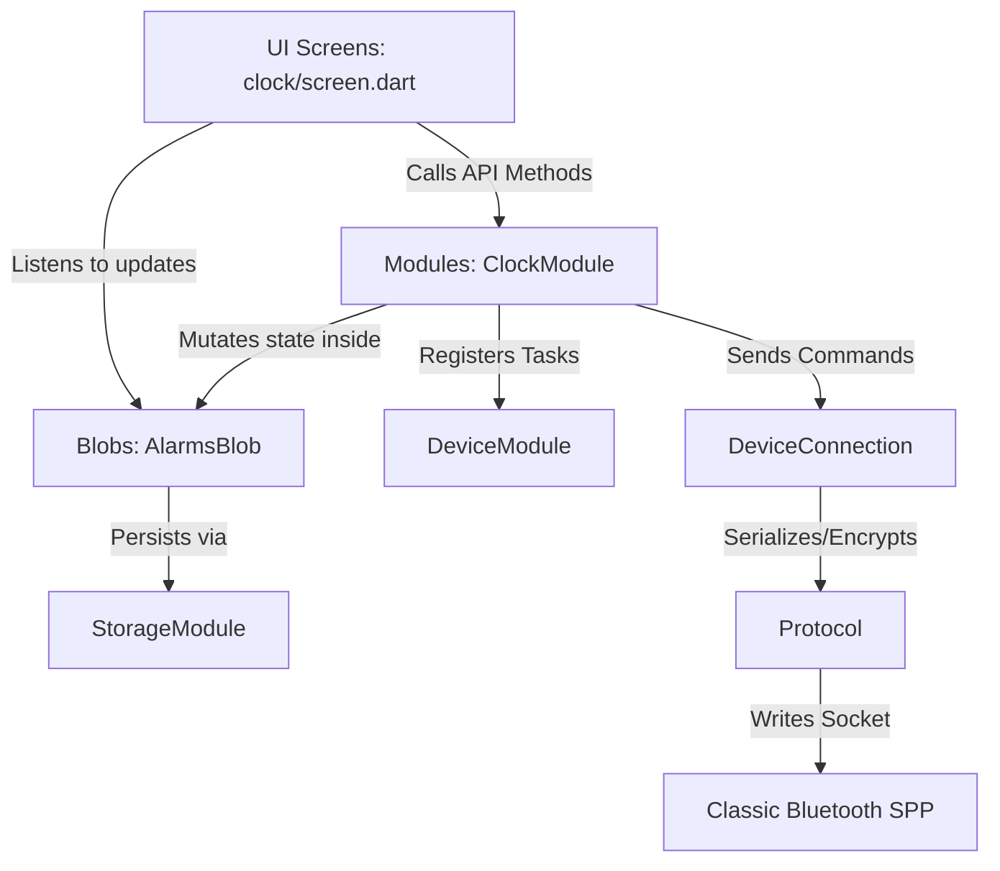

# MiSync Developer Guide

Welcome to the **MiSync** developer guide. This document serves as the onboarding and reference manual for engineers (and AI coding agents) building on top of the MiSync codebase. It covers the architecture, the Bluetooth/SPP protocol stack, cryptographic handshakes, code generation, reference tools, and a step-by-step tutorial for adding new modules.

---

## 1. Project Philosophy & Architecture

MiSync is built as a highly decoupled companion application using Flutter. The architecture separates protocol serialization, business logic, storage, and UI into clear layers:



### Core Architecture Components

1.  **`lib/main.dart` (Bootstrapper)**: Defines the global list of `modules`. Bootstraps and awaits the sequential asynchronous lifecycles of all modules in a loop.
2.  **Modules (`lib/<feature>/module.dart`)**: The logical engine of a feature.
    * Implement the **`Module`** interface (for background/framework services like `StorageModule`, `PlatformModule`).
    * Implement the **`TabModule`** interface (for user-facing features that render in navigation tabs). They override properties: `String get name` (lowercase, e.g., `'device'`, `'clock'`), `IconData get icon`, and `Widget get screen`.
    * **Best Practice**: All data mutation operations (e.g. `addAction`, `deleteAction`, `editAlarm`, `removeApp`) should be defined as methods on the `Module` class. Screen classes should call these methods rather than mutating blobs directly in the view layer.
3.  **Blobs (`lib/<feature>/blobs/<name>.dart`)**: Reactive state holders extending `Blob<T>`. They automatically read/write JSON values to the persistent key-value store (`StorageModule`) and notify UI screens upon updates.
4.  **Screens (`lib/<feature>/screen.dart`)**: Independent presentation layer extending `ScreenState<T>`. 
    * Screens **never** interact directly with the Bluetooth connection or write directly to the database. They delegate updates to the `Module`.
    * All screen states extend `ScreenState<T>` and override `Widget buildScreen(BuildContext context, bool connected)`. The base class automatically wraps the tree in a `ValueListenableBuilder` listening to `DeviceConnection.connected`.
    * Interactive controls (switches, text fields, adding/editing/deleting elements) **must be disabled** when `connected` is false.
    * **Specific Subclass Getter**: To call features on the module, screens should type-specialize the `module` getter override returning the concrete implementation class (e.g., `ClockModule get module => ClockModule.instance;`) instead of returning the abstract `Module` base class.
    * **Piggyback on refresh()**: Do **not** override `initState()` manually in a screen state to trigger initial logic or query native endpoints. Instead, override `refresh()` (and remember to await `super.refresh()`), which the base class `ScreenState` automatically invokes at initialization and connection changes.
    * **Reactive Lists**: Use `ListenableBuilder` tied directly to the module's `Blob` instance to automatically redraw views on modification and support instant, side-effect-free updates.
    * **Manifest Permissions Requirement**: If you add any custom permission (such as `calendar`) inside `module.permissions`, you must explicitly register it inside `android/app/src/main/AndroidManifest.xml` (e.g., `<uses-permission android:name="android.permission.READ_CALENDAR" />`), otherwise the permission dialog popup will fail silently.
5.  **`DeviceConnection` (`lib/device/connection.dart`)**: The unified Bluetooth SPP connection and protocol manager. Exposes `DeviceConnection.listen((cmd) => ...)` and `DeviceConnection.send(...)` to other modules.

---

## 2. Protobuf & Code Generation

All payloads exchanged with the watch are serialized using Google Protocol Buffers. 

-   **Protobuf Source**: [proto/xiaomi.proto](file:///Users/awgneo/Repositories/awgneo/misync/proto/xiaomi.proto)
-   **Generated Files**: Located in `lib/device/proto/xiaomi.pb.dart` (and companion files).

### Compiling Protobuf to Dart

If you modify `xiaomi.proto`, you must compile the changes to Dart. Ensure the `protoc` compiler and the `protoc-gen-dart` plugin are installed:

```bash
# 1. Install protoc-gen-dart if you don't have it
dart pub global activate protoc_plugin

# 2. Run compilation from root directory
protoc --dart_out=lib/device/proto -Iproto proto/xiaomi.proto
```

---

## 3. SPP Protocol & Packet Framing

The Xiaomi Smart Band 10 Pro communicates over Classic Bluetooth RFCOMM (Serial Port Profile - SPP) using a custom packet layout (L1/L2/L3 framing).

### Packet Format (L1/L2 Layout)

Each packet sent over RFCOMM starts with a header:

| Offset (Bytes) | Size (Bytes) | Field Name | Description |
| :--- | :--- | :--- | :--- |
| `0` | 2 | **Preamble** | Magic bytes: `0xA5A5` |
| `2` | 1 | **Packet Type** | `1` = Acknowledgment, `2` = Session Config, `3` = Secure Command |
| `3` | 1 | **Sequence ID** | Rotating sequence number |
| `4` | 2 | **Payload Length**| Big-endian length of the encrypted/raw payload |
| `6` | 2 | **CRC-16** | CRC-16 CCITT (Poly `0x1021`, Initial `0xFFFF`) calculated over header + payload |
| `8` | Variable | **Payload** | Raw bytes or AES-CCM encrypted protobuf bytes |

### AES-CCM Encryption

For **Packet Type 3 (Secure Command)**, the payload is encrypted using **AES-CCM** with:
-   **Nonce**: Formed dynamically using a combination of sequence IDs and a custom initialization salt.
-   **Session Key**: Initially derived during the basic handshake, then upgraded to secondary session keys upon successful second-stage verification.

---

## 4. Dual-Stage Authentication & Handshake Flow

To successfully query device statistics or execute edits, the app must authenticate the secure channel in two sequential stages.

### Stage 1: Basic Handshake (Key Exchange)
1.  **Phone Nonce (subtype 26)**: Phone generates a random 16-byte nonce and sends it to the watch.
2.  **Watch Nonce (subtype 26)**: Watch responds with its 16-byte nonce.
3.  **HKDF Derivation**: Both sides run HKDF-SHA256 over the nonces to derive `sessionKeys`.

### Stage 2: Secondary Handshake (Mi Fitness Protocol)
Xiaomi HyperOS requires an additional verification step before allowing data sync.
1.  **AppVerify (subtype 26)**: Phone generates a random 16-byte `appNonce`, wraps it in `PhoneNonce` protobuf (tag 30), and sends it encrypted using Stage 1 keys.
2.  **DeviceVerify (subtype 26)**: Watch responds with `WatchNonce` (tag 31) containing `deviceNonce` and a watch confirmation HMAC.
3.  **Secondary Keys Derivation**: Re-runs HKDF over `appNonce` and `deviceNonce` to produce the `secondarySessionKeys` (both encryption and MAC verification keys).
4.  **AppConfirm (subtype 27)**: Phone prepares `AuthDeviceInfo` (note: `unknown1 = 0` must be explicitly serialized to prevent padding errors). The phone encrypts this payload using AES-CCM with `secondarySessionKeys.encryptionKey` and a custom 12-byte nonce layout (`[encryptionNonce (4 bytes)] + [0 (4 bytes)] + [0 (4 bytes)]`) and transmits it.
5.  **DeviceConfirm (subtype 27)**: Watch decrypts, verifies, and returns a successful confirm message (`unknown1 = 1`).
6.  **Handshake Completion**: The protocol manager updates the secure channel to permanently use `secondarySessionKeys` for all future transmissions.

---

## 5. Decompiled References & AOSP Codebases

To map out command types, payload definitions, and fields without guessing, utilize the reference folders:

-   **Mi Fitness Decompiled Source**: Located in [apks/mi_fitness_source](file:///Users/awgneo/Repositories/awgneo/misync/apks/mi_fitness_source). Run a global text search here using `grep` or VS Code to find where protobuf tags are referenced. Look for files named `WearAuthV2.java` or `ScheduleService.java`.
-   **Gadgetbridge Source Reference**: Located in [gadgetbridge_src](file:///Users/awgneo/Repositories/awgneo/misync/gadgetbridge_src). This provides clean, working implementations of HyperOS services (e.g., `XiaomiScheduleService.java` for alarms, DND handling, and battery reporting).

---

## 6. Shared & DRY Platform UI Components

To maintain consistency and rich styling across screens, utilize these shared types and widgets located in the `lib/widgets/` directory:

### 1. `App` Model (`lib/platform/app.dart`)
Represents an installed system application with type safety:
```dart
class App {
  final String package;
  final String name;
  final Uint8List? icon;

  const App({required this.package, required this.name, this.icon});
}
```

### 2. `MiPanel` (`lib/widgets/panel.dart`)
The root scrolling container for tab screens. Handles consistent padding, margins, and floating action button stack placement:
```dart
MiPanel(
  buttons: connected ? MiButtons(children: [...]) : null,
  child: Column(children: [...]),
)
```

### 3. `MiButton` & `MiButtons` (`lib/widgets/button.dart`)
Floating Action Button controller. Renders a single FAB if only one child is supplied, or compiles a premium slide-up mini FAB list menu when there are two or more children:
```dart
MiButtons(
  children: [
    MiButton(
      label: 'Add Action',
      icon: Icons.add,
      pressed: _addAction,
    ),
  ],
)
```

### 4. `MiItems` (`lib/widgets/items.dart`)
A dark, rounded-corner container (`#141822`) used to group multiple items inside a sleek card block. It automatically draws consistent divider lines (`#26324D`) between adjacent child items.

### 5. `MiItem` (`lib/widgets/item.dart`)
A highly configurable, standard row widget matching the premium look of the application. It supports:
*   **Wipe/Delete Action**: Exposes a left-side red trash icon (`delete`).
*   **Custom Labels**: `title` and `subtitle` values.
*   **Interactive Toggles**: Built-in `Switch` configuration (`enabled`, `toggled`).
*   **Interactive Selection**: Nested dropdown configurations (`options`, `value`, `selected`).
*   **Custom Action button**: Replaces/appends right side elements (`order`, `secondaryIcon`).
*   **Click Handler**: Tapping the title/subtitle row triggers a callback (`clicked`).

```dart
MiItem(
  title: 'Smart Wake',
  subtitle: 'Wakes you up during light sleep',
  enabled: _smartWake,
  toggled: (val) => setState(() => _smartWake = val),
)
```

### 6. `showMiModal` (`lib/widgets/modal.dart`)
Exposes premium, round-cornered confirmation overlays. Can be parameterized to gather text input or act as confirmation dialogues:
```dart
// 1. Text Input Dialog
final String? input = await showMiModal<String>(
  context: context,
  title: 'Canned Reply',
  label: 'Text (e.g. Yes, on my way!)',
);

// 2. Simple Action Confirm
final bool? confirm = await showMiModal<bool>(
  context: context,
  title: 'Delete Item?',
  body: 'This action is irreversible.',
);
```

### 7. `MiTabs` & `MiTab` (`lib/widgets/tabs.dart`)
Scrollable tab controller for nesting view panels:
```dart
MiTabs(
  tabs: [
    MiTab(label: 'Apps', child: _buildAppsView()),
    MiTab(label: 'Quick Replies', child: _buildRepliesView()),
  ],
)
```

### 8. `MiPicker` Bottom Sheet (`lib/widgets/picker.dart`)
A DRY bottom drawer listing all system applications, with built-in alphabetical sorting and real-time search-filtering:
```dart
showModalBottomSheet(
  context: context,
  isScrollControlled: true,
  backgroundColor: Colors.transparent,
  builder: (context) => MiPicker(
    registeredFilters: activeFiltersList,
    onAppSelected: (packageName) => module.addFilter(packageName),
  ),
);
```

---

## 7. How to Implement a New Module (Walkthrough)

If you are developing a new feature (e.g., **DND Synchronization**), follow these structured steps:

### Step 1: Check the Protobuf definitions
Inspect `xiaomi.proto` to locate DND/Do Not Disturb structures (usually inside `message System` or tag 19 `Schedule`). Make sure you know the command type and subtypes.

### Step 2: Create the Persistent Blob
Create a reactive storage class in `lib/dnd/blobs/dnd_settings.dart` to hold state:
```dart
import '../../storage/blob.dart';

class DndBlob extends Blob<Map<String, dynamic>> {
  static final DndBlob _instance = DndBlob._();
  static DndBlob get instance => _instance;

  DndBlob._() : super(
    module: 'dnd',
    name: 'settings',
    defaultValue: {'enabled': false},
  );

  @override
  Map<String, dynamic> parse(dynamic json) => Map<String, dynamic>.from(json);

  @override
  dynamic serialize(Map<String, dynamic> value) => value;
}
```

### Step 3: Implement the Module Lifecycle (TabModule)
Create `lib/dnd/module.dart` implementing `TabModule`:
```dart
import 'package:flutter/material.dart';
import '../module.dart';
import '../device/connection.dart';
import '../device/proto/xiaomi.pb.dart';
import '../device/proto/constants.dart';
import '../debug/logger.dart';
import 'blobs/dnd_settings.dart';
import 'screen.dart';

class DndModule implements TabModule {
  static final DndModule instance = DndModule._();
  DndModule._();

  @override
  String get name => 'dnd';

  @override
  IconData get icon => Icons.do_not_disturb;

  @override
  Widget get screen => const DndScreen();

  @override
  Future<void> start() async {
    // Listen to incoming watch messages for changes set on-wrist
    DeviceConnection.listen((cmd) {
      if (cmd.type == CmdType.system.value && cmd.subtype == SystemSubtype.dnd.value) {
        _handleWatchDndUpdate(cmd);
      }
    });
  }

  @override
  Future<void> sync() async {
    if (!DeviceConnection.connected.value) return; // Top-level sync guard
    await syncDndToWatch();
  }

  void updateDnd(bool enabled) {
    DndBlob.instance.update({'enabled': enabled});
    syncDndToWatch();
  }

  Future<void> syncDndToWatch() async {
    final enabled = DndBlob.instance.value['enabled'] ?? false;
    await DeviceConnection.send(
      type: CmdType.system,
      subtype: SystemSubtype.dnd,
      builder: (cmd) => cmd.system = (System()
        ..dndStatus = (DoNotDisturb()..status = enabled ? 1 : 2)),
    );
  }

  void _handleWatchDndUpdate(Command cmd) {
    DndBlob.instance.update({'enabled': cmd.system.dndStatus.status == 1});
  }
}
```

### Step 4: Register in `lib/main.dart`
Add your module singleton to the top-level `modules` list in [main.dart](file:///Users/awgneo/Repositories/awgneo/misync/lib/main.dart):
```dart
final List<Module> modules = [
  StorageModule.instance,
  PlatformModule.instance,
  DeviceModule.instance,
  ClockModule.instance,
  NotificationModule.instance,
  FacesModule.instance,
  HealthModule.instance,
  ActionsModule.instance,
  DebugModule.instance,
  DndModule.instance, // Registered! Will start boot loop & mount navigation tab automatically.
];
```

### Step 5: Build the Screen UI
Create `lib/dnd/screen.dart` and bind elements using `buildScreen`:
```dart
import 'package:flutter/material.dart';
import '../screen.dart';
import 'blobs/dnd_settings.dart';
import 'module.dart';

class DndScreen extends StatefulWidget {
  const DndScreen({super.key});

  @override
  State<DndScreen> createState() => _DndScreenState();
}

class _DndScreenState extends ScreenState<DndScreen> {
  @override
  DndModule get module => DndModule.instance;

  @override
  Widget buildScreen(BuildContext context, bool connected) {
    return ListenableBuilder(
      listenable: DndBlob.instance,
      builder: (context, _) {
        final dndEnabled = DndBlob.instance.value['enabled'] ?? false;
        return SwitchListTile(
          title: const Text("Do Not Disturb"),
          value: dndEnabled,
          onChanged: connected 
              ? (val) => module.updateDnd(val) 
              : null, // Grayed out when watch is disconnected
        );
      },
    );
  }
}
```

---

## 8. Debugging Workflows & Commands

Use these commands to trace protocols, dumpsys states, and logs:

### Viewing Real-Time Logs
Watch packets, parse events, and connection status directly through Logcat or the built-in Developer tab:
```bash
# General flutter running logs
flutter run

# Filter by application logs via ADB
adb logcat -s flutter
```

### Dumping Registered Alarms
Verify if your alarm is registered in the Android system database:
```bash
adb shell dumpsys alarm | grep -A 5 "Next alarm clock information"
```

### Viewing Classic Bluetooth Details
Retrieve local bonded devices and connection attributes:
```bash
adb shell dumpsys bluetooth_manager
```

---

## 9. Telephony & Notification Control Patterns

To keep permissions minimal and user setup simple, MiSync utilizes specialized patterns for handling telephony controls and bridging watch actions to the phone.

### Permission-Free Call Rejection
Standard Android API calls for rejecting/ending calls (e.g., `TelecomManager.endCall()`) require the system permission `ANSWER_PHONE_CALLS` which prompts the user with intrusive runtime permission dialogs. 

To bypass this, MiSync scans the action buttons attached to the dialer's status bar notification itself.
1. When a call notification is dismissed or replied to from the watch:
2. The `NotificationService` scans the list of `Notification.Action` items on the active status bar notification.
3. It performs a case-insensitive keyword match on the action titles (e.g., searching for `"decline"`, `"hang"`, `"reject"`, `"挂断"`, `"拒绝"`).
4. If a matching action is found, it sends the action's pending intent directly: `action.actionIntent.send()`.
5. This rejects the call immediately at the system level without requiring any telephony permissions.

### Custom Intercepts & Watch Launcher Caching
When a notification is received in `NotificationModule`, we check if it is a messaging app or a phone call.
- Dialer and telecom packages (`com.google.android.dialer`, `com.android.phone`, `com.android.server.telecom`, etc.) are recognized as interactive notifications.
- When an active call or chat notification arrives, we cache it in `ActionsModule.activeNotification`.
- When the user swipes to dismiss or replies on the watch, the watch sends a wrist dismiss event back to the phone. Since the package is cached in `activeNotification` as an interactive type, the phone immediately triggers the watch Messages Quick Reply app to launch on the wrist.
- Once the user types a quick reply or dismisses, the phone executes the programmatic decline, ensuring a seamless wrist-to-telephony integration.
