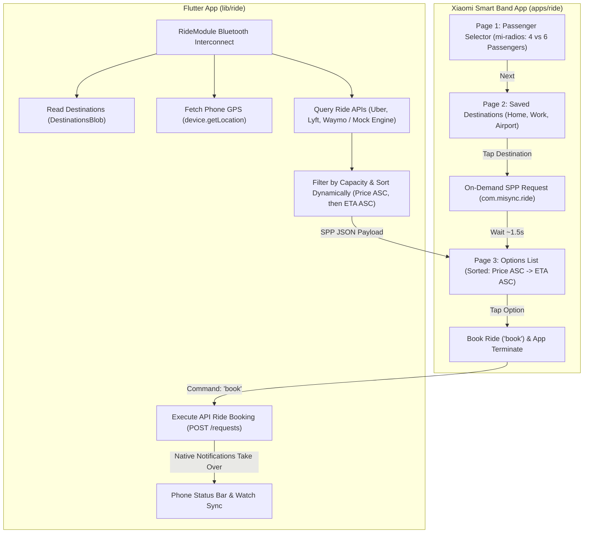

# Ride QuickApp & Companion Module Implementation Plan (`com.misync.ride`)

Build an on-demand ride-hailing QuickApp for Xiaomi Smart Band (`apps/ride/`) and an accompanying Flutter phone module (`lib/ride/`) providing live price-and-ETA-sorted rides across **Uber**, **Lyft**, and **Waymo** for phone-configured destinations with 100% watch-driven booking.

---

## Watch User Workflow (3-Page Architecture)

---

## User Feedback Incorporated

> [!IMPORTANT]
> 1. **First-Class Radio Shared Components**:
>    - Create dedicated `<mi-radios>` (`apps/shared/components/radios.ux`) and `<mi-radio>` (`apps/shared/components/radio.ux`) components in the shared QuickApp library rather than overloading `mi-button`.
>    - `mi-radio` displays a clean selection row with a radio dot indicator, label, value, selected state, and haptic tap feedback (`vibrator.vibrate({ mode: 'short' })`).
> 2. **Interconnect Command Naming**:
>    - Booking interconnect command dispatched from watch to phone is named **`book`** (not `bookRide`).
> 3. **QuickApp Bootstrap**: Bootstrap `apps/ride/` directly by copying `apps/messages/` as the initial base layout.
> 4. **Immediate Booking Action**: Tapping an option on Page 3 dispatches `book` to the phone and immediately calls `app.terminate()`.
> 5. **Dynamic Estimates (No Blob Storage)**: Ride estimates are transient and pulled dynamically on-demand when requested by the watch. No estimate data is saved in blobs.
> 6. **Blob & File Naming**:
>    - `Destination` model inside `DestinationsBlob` (`lib/ride/blobs/destinations.dart`).
>    - `Ride` model inside `RidesBlob` (`lib/ride/blobs/rides.dart`).
>    - Source interface in [lib/ride/sources/source.dart](file:///Users/awgneo/Repositories/awgneo/misync/lib/ride/sources/source.dart).

---

## Proposed Changes

### Component 1: QuickApp Shared Library (`apps/shared/`)

#### [NEW] [radio.ux](file:///Users/awgneo/Repositories/awgneo/misync/apps/shared/components/radio.ux)
- `<mi-radio>` component: Renders a single radio option row with indicator dot/circle, value, label, active selection styling, haptic feedback, and `@select` event.

#### [NEW] [radios.ux](file:///Users/awgneo/Repositories/awgneo/misync/apps/shared/components/radios.ux)
- `<mi-radios>` container component: Manages single-selection `value` state across child `<mi-radio>` elements and emits `@change`.

---

### Component 2: Watch QuickApp (`apps/ride/`)

#### [NEW] [apps/ride/](file:///Users/awgneo/Repositories/awgneo/misync/apps/ride/)
- Bootstrap directory structure by copying `apps/messages/` to `apps/ride/`.

#### [MODIFY] [manifest.json](file:///Users/awgneo/Repositories/awgneo/misync/apps/ride/src/manifest.json)
- Define QuickApp package `com.misync.ride`, name `"Ride"`, and system features (`system.router`, `system.interconnect`, `system.vibrator`, `system.file`, `system.app`).

#### [MODIFY] [pages/index/index.ux](file:///Users/awgneo/Repositories/awgneo/misync/apps/ride/src/pages/index/index.ux)
- **Page 1 (Passenger Selector)**: `<mi-radios>` with `<mi-radio value="4" label="4 Passengers"></mi-radio>` and `<mi-radio value="6" label="6 Passengers"></mi-radio>`. Selecting a capacity advances to Page 2.
- **Page 2 (Destination Picker)**: Pre-configured destination rows ("Home", "Work", "Airport", etc.) loaded dynamically from the phone via `getDestinations`.
- **Page 3 (Price & ETA Sorted Options)**: Displays live ride options sorted strictly by **Cheapest Price First**, and **Shortest Wait Time (ETA) Second**.
- **Booking**: Tapping an option dispatches command `book` and immediately invokes `app.terminate()`.

---

### Component 3: Phone App State & Storage (`lib/ride/blobs/`)

#### [NEW] [destinations.dart](file:///Users/awgneo/Repositories/awgneo/misync/lib/ride/blobs/destinations.dart)
- `Destination`: Model with `id`, `name`, `address`, `latitude`, `longitude`, `icon`.
- `DestinationsBlob`: Persistent storage extending `Blob<List<Destination>>`.

#### [NEW] [rides.dart](file:///Users/awgneo/Repositories/awgneo/misync/lib/ride/blobs/rides.dart)
- `Ride`: Model holding provider credentials, active toggles, and mock mode configuration.
- `RidesBlob`: Persistent storage extending `Blob<Ride>`.

---

### Component 4: Phone Ride Provider Integrations (`lib/ride/sources/`)

#### [NEW] [source.dart](file:///Users/awgneo/Repositories/awgneo/misync/lib/ride/sources/source.dart)
- Abstract `RideSource` interface defining `getEstimate` and `bookRide`.

#### [NEW] [uber.dart](file:///Users/awgneo/Repositories/awgneo/misync/lib/ride/sources/uber.dart)
- Uber Rides API integration with Mock Provider fallback.

#### [NEW] [lyft.dart](file:///Users/awgneo/Repositories/awgneo/misync/lib/ride/sources/lyft.dart)
- Lyft Cost API integration with Mock Provider fallback.

#### [NEW] [waymo.dart](file:///Users/awgneo/Repositories/awgneo/misync/lib/ride/sources/waymo.dart)
- Waymo API driver integration with Mock Provider fallback.

---

### Component 5: Phone Ride Module & Management UI (`lib/ride/`)

#### [NEW] [module.dart](file:///Users/awgneo/Repositories/awgneo/misync/lib/ride/module.dart)
- `RideModule` extending `TabModule`.
- Registers interconnect listener for `com.misync.ride`:
  - `getDestinations`: Returns stored destinations from `DestinationsBlob`.
  - `getEstimates`: Obtains GPS, queries enabled sources concurrently, filters by capacity, sorts dynamically (Price ASC, then ETA ASC), and returns JSON to watch.
  - `book`: Executes ride booking via target provider API.

#### [NEW] [screen.dart](file:///Users/awgneo/Repositories/awgneo/misync/lib/ride/screen.dart)
- Phone UI with **2 MiSync Tabs**:
  - **Providers Tab**: Provider toggles, credentials, and Mock Mode switch.
  - **Destinations Tab**: Add/edit/delete saved destinations.

---

### Component 6: Project Integration & Build System

#### [MODIFY] [main.dart](file:///Users/awgneo/Repositories/awgneo/misync/lib/main.dart)
- Import and register `RideModule.module` in `modules` list.

#### [MODIFY] [flow](file:///Users/awgneo/Repositories/awgneo/misync/flow)
- Add `ride` to watch app build targets.

---

## Verification Plan

### Automated Tests
- Flutter code & build checks: `./flow debug`
- QuickApp bundle compilation: `npx aiot build` inside `apps/ride/`

### Manual Verification
1. Configure destinations in `DestinationsBlob` and providers in `RidesBlob`.
2. Open `Ride` app on watch:
   - Select passenger count via `<mi-radio>` (4 vs 6).
   - Select destination.
3. Verify live estimates arrive over Bluetooth and render sorted by cheapest price first, then ETA.
4. Tap an option to book (dispatches command `book`) and verify app terminates immediately while phone executes booking.
