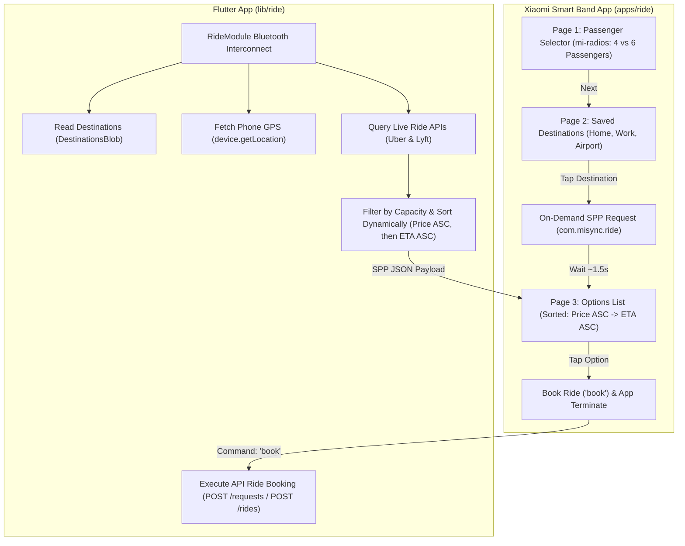

# Ride QuickApp & Companion Module Specification (`com.misync.ride`)

On-demand ride-hailing QuickApp for Xiaomi Smart Band (`apps/ride/`) and companion Flutter module (`lib/ride/`) providing live price-and-ETA-sorted rides across **Uber** and **Lyft** for phone-configured destinations with watch-driven booking.

---

## Watch User Workflow (3-Page Architecture)

---

## Architecture

1. **Watch QuickApp (`apps/ride/`)**:
   - `pages/index/index.ux`: Passenger capacity selection (`4` vs `6` passengers) using `<mi-radios>` / `<mi-radio>`.
   - `pages/destinations/index.ux`: Saved destination picker populated from phone over Bluetooth (`getDestinations`).
   - `pages/estimates/index.ux`: Live list of available ride options sorted strictly by **Cheapest Price First**, and **Shortest ETA Second**. Tapping any option dispatches `book` and calls `app.terminate()`.

2. **Phone Module & Storage (`lib/ride/`)**:
   - `blobs/destinations.dart`: `DestinationsBlob` holds saved destinations with coordinates.
   - `blobs/rides.dart`: `RidesBlob` holds provider configurations and credentials for Uber and Lyft.
   - `sources/source.dart`: Abstract `RideSource` interface (`authenticate`, `getEstimates`, `book`).
   - `sources/uber.dart`: `UberSource` calling live Uber Rides REST APIs (`GET /v1.2/estimates/price`, `POST /v1.2/requests`).
   - `sources/lyft.dart`: `LyftSource` calling live Lyft REST APIs (`GET /v1/cost`, `POST /v1/rides`).
   - `module.dart`: `RideModule` manages Bluetooth interconnect messages, queries GPS coordinates, dispatches concurrent API requests, sorts results, and handles booking.
   - `screen.dart`: `RideScreen` follows the `FinanceScreen` pattern: reads blobs for UI, opens `MiPopup.show` credential modals for Uber and Lyft, and mutates state exclusively via module methods..

---

## User Feedback Incorporated

> [!IMPORTANT]
> 1. **First-Class Radio Shared Components**:
>    - Create dedicated `<mi-radios>` (`apps/shared/components/radios.ux`) and `<mi-radio>` (`apps/shared/components/radio.ux`) components in the shared QuickApp library rather than overloading `mi-button`.
>    - `mi-radio` displays a clean selection row with a radio dot indicator, label, value, selected state, and haptic tap feedback (`vibrator.vibrate({ mode: 'short' })`).
> 2. **Interconnect Command Naming**:
>    - Booking interconnect command dispatched from watch to phone is named **`book`** (not `bookRide`).
> 3. **QuickApp Bootstrap**: Bootstrap `apps/ride/` directly by copying `apps/messages/` as the initial base layout.
> 4. **Immediate Booking Action**: Tapping an option on Page 3 dispatches `book` to the phone and immediately calls `app.terminate()`.
> 5. **Dynamic Estimates (No Blob Storage)**: Ride estimates are transient and pulled dynamically on-demand when requested by the watch. No estimate data is saved in blobs.

---

### Component 6: Project Integration & Build System

#### [MODIFY] [main.dart](file:///Users/awgneo/Repositories/awgneo/misync/lib/main.dart)
- Import and register `RideModule.module` in `modules` list.

#### [MODIFY] [flow](file:///Users/awgneo/Repositories/awgneo/misync/flow)
- Add `ride` to watch app build targets.

---

## Verification Plan

### Automated Tests
- Flutter code & build checks: `./flow debug`
- QuickApp bundle compilation: `npx aiot build` inside `apps/ride/`

### Manual Verification
1. Configure destinations in `DestinationsBlob` and providers in `RidesBlob`.
2. Open `Ride` app on watch:
   - Select passenger count via `<mi-radio>` (4 vs 6).
   - Select destination.
3. Verify live estimates arrive over Bluetooth and render sorted by cheapest price first, then ETA.
4. Tap an option to book (dispatches command `book`) and verify app terminates immediately while phone executes booking.
